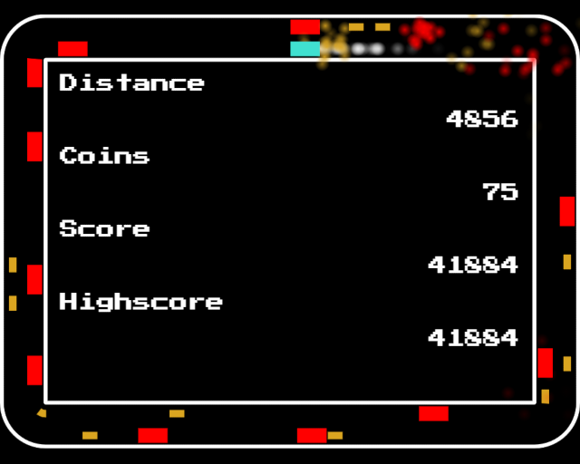

This is my entry for LD 47. Evade the red obstacles and collect the golden coins.

I purposefully kept this one really small in scope, since I did not feel like actually investing the entire weekend. I am pretty happy with how it turned out, I am getting pretty good at estimating how much I can do on a LD Weekend.

This game is fully implemented using html5 + javascript. Any modern browser should be able to run it, but I only tested in Google Chrome.

TODO [Rate here](https://ldjam.com/events/ludum-dare/47/TODO)

## Controls
- Left/A - Evade towards the center
- Right/D - Evade towards the outside
- M - Mute/Unmute

## Library/Engine
- [Playground.js by rezoner](https://github.com/rezoner/playground) (no longer maintained, docs offline)

## Tools
- [Visual Studio Code by Microsoft](https://code.visualstudio.com/)
- [Google Chrome](https://www.google.com/intl/de_de/chrome/)
- [SFXR by DrPetter](http://www.drpetter.se/project_sfxr.html)